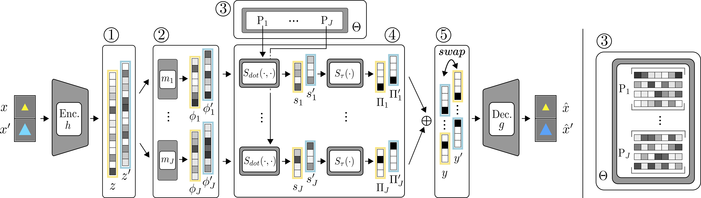
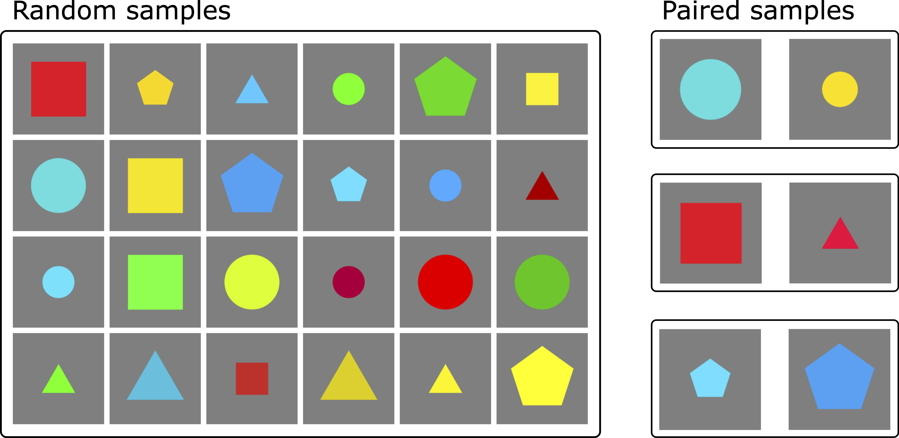

# Explanatory Interactive Concept Learning

This is the official repository of the article: [Interactive Disentanglement: Learning Concepts by Interacting with 
their Prototype Representations](https://arxiv.org/pdf/2112.02290.pdf) by Wolfgang Stammer, Marius Memmel, 
Patrick Schramowski, and Kristian Kersting, published at CVPR 2022.

This repository contains all source code required to reproduce the main experiments of the paper.

In this work, we show the advantages of prototype representations for understanding and revising the latent space of 
neural concept learners. For this purpose, we introduce interactive Concept Swapping Networks (iCSNs), a novel 
framework for learning concept-grounded representations via weak super-vision and implicit prototype representations. 
iCSNs learn to bind conceptual information to specific prototype slots by swapping the latent representations of paired 
images. This semantically grounded and discrete latent space facilitates human understanding and human-machine 
interaction. We support this claim by conducting experiments on our novel data set “Elementary Concept Reasoning” 
(ECR), focusing on visual concepts shared by geometric objects.

Interactive Concept Swapping Network Overview:



## Elementary Concept Reasoning (ECR) Dataset

The novel ECR dataset can be downloaded from [here](https://tudatalib.ulb.tu-darmstadt.de/handle/tudatalib/3426) or via:

```wget https://tudatalib.ulb.tu-darmstadt.de/bitstream/handle/tudatalib/3426/ECR.zip```

```unzip ECR.zip``` 

Please copy or link the downloaded data to ```Data/``` 

```ECR_Gen/``` contains the scripts for generating the different versions of the dataset.

<!---
Overview of ECR dataset:

-->

## Weakly-Supervised and Interactive Prototype Learning

### iCSN experiments

We have moved a minimal example of the iCSN framework into the directory ```icsn/``` which shows how to train an 
[introvae](https://github.com/hhb072/IntroVAE)-based autoencoder within the framework. This code also shows how to 
handle unsupervised pretraining and a more sophisticated temperature scheduling than used in the original paper.

The relevant source code for the iCSN experiments of the paper can be found in the ```experiments``` directory under 
```ProtoLearning/```, with ```ProtoLearning/train_icsn.py``` and ```ProtoLearning/scripts/run_icsn.sh``` containing 
the main iscn training procedure and calls. This directory further contains scripts for interacting with the latent 
space (```ProtoLearning/scripts/run_icsn_rr.sh```) and experiments on novel concepts 
(```ProtoLearning/scripts/run_icsn_{nospot, spot, novelshape}.sh```).

```experiments/BaseVAEs/``` contains the scripts for the baseline models. It contains an old version of the 
[disent repository](https://github.com/nmichlo/disent).

Finally, ```experiments/analysis_scripts/``` contains jupyter notebooks for the linear probing analysis as well as the novel shape 
experiments.

To run any of the scripts call them as ```icsn/scripts/run_icsn.sh 0 1``` with 0 indicating the GPU ID and 1 the random 
seed.

### Docker

We have attached a Dockerfile to make reproduction easier. We further recommend to build your own docker-compose file
based on the DockerFile. To run without a docker-compose file:

1. ```cd docker/```

2. ```docker build -t proto-learn -f Dockerfile .```

3. ```docker run -it -v /pathtorepo:/workspace/repositories/XIConceptLearning --name proto-learn --entrypoint='/bin/bash' --runtime nvidia proto-learn```

## Citation
If you find this code useful in your research, please consider citing:

> @article{stammer2021,
  author    = {Wolfgang Stammer and
               Marius Memmel and
               Patrick Schramowski and
               Kristian Kersting},
  title     = {Interactive Disentanglement: Learning Concepts by Interacting with
               their Prototype Representations},
  journal   = {CoRR},
  year      = {2021},
}

